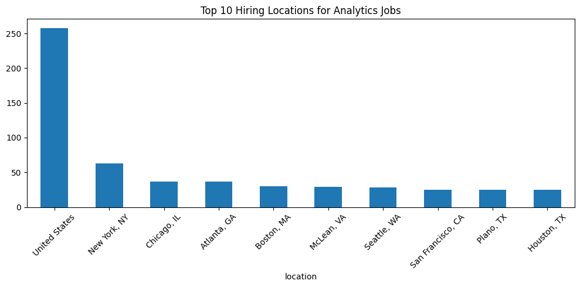
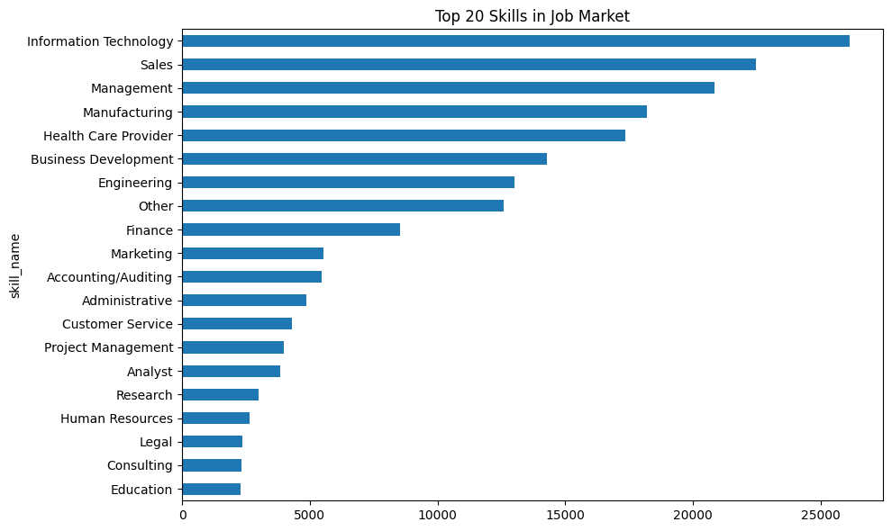
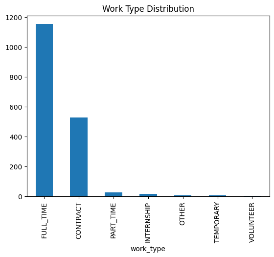
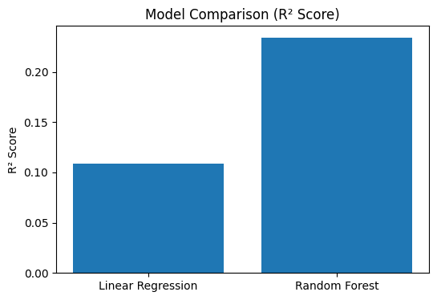
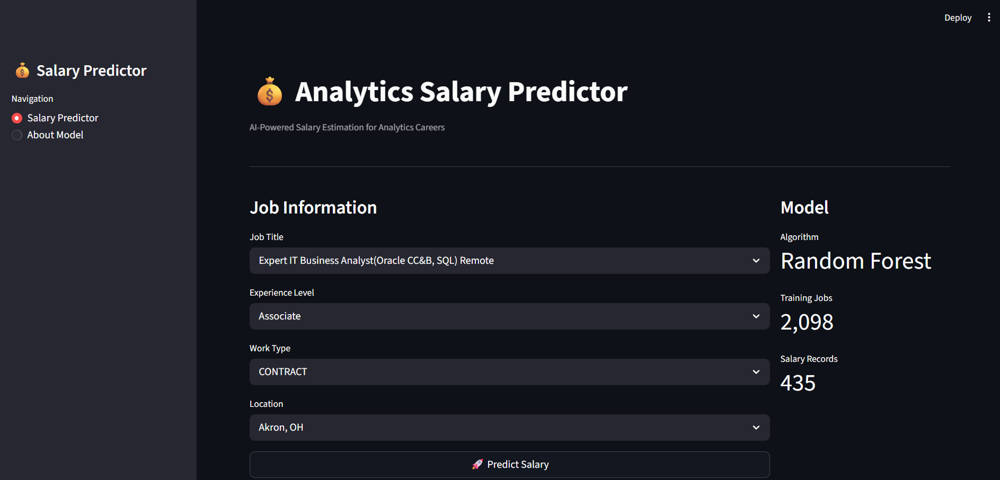
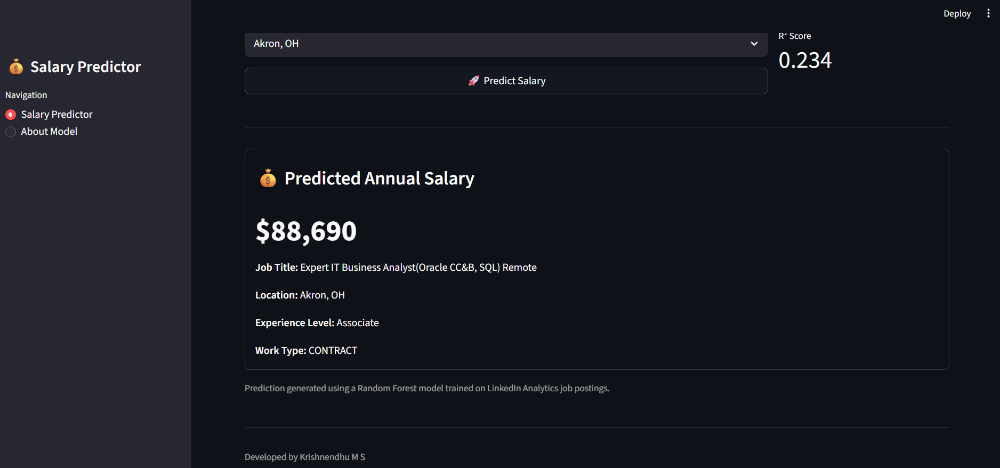
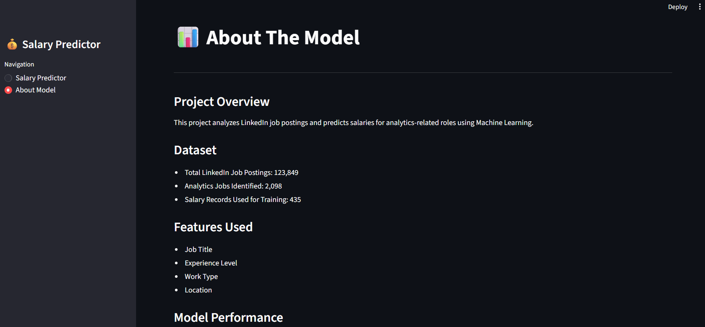

# 💰 Analytics Salary Predictor

An end-to-end Data Analytics and Machine Learning project that analyzes LinkedIn job postings and predicts salaries for analytics-related roles.

## 🚀 Live Demo

🌐 Streamlit App: *(Add your Streamlit deployment link here after deployment)*

---

## 📌 Project Overview

This project presents an end-to-end analytics solution built using LinkedIn job posting data. It combines data analysis, machine learning, and application deployment to provide salary predictions for analytics professionals based on job characteristics such as role, experience level, work type, and location.

### Project Highlights

* Processed and analyzed **123,000+ LinkedIn job postings**
* Identified analytics-related opportunities and salary trends
* Built and evaluated machine learning models for salary prediction
* Deployed an interactive Streamlit application for real-time predictions
* Demonstrated practical skills in data analytics, machine learning, and data-driven decision-making

The final application allows users to estimate salaries for analytics-related jobs based on:

* Job Title
* Experience Level
* Work Type
* Location

---

## 🔄 Project Workflow

1. Collected and explored LinkedIn job posting data
2. Filtered analytics-related roles
3. Cleaned and preprocessed data
4. Performed Exploratory Data Analysis (EDA)
5. Identified hiring trends and in-demand skills
6. Built salary prediction models
7. Evaluated model performance
8. Deployed an interactive Streamlit application

---

## 📊 Dataset

### Original Dataset

* Total LinkedIn Job Postings: **123,849**
* Features: **31**

### Analytics Jobs Extracted

The dataset was filtered to include analytics-related roles such as:

* Data Analyst
* Business Analyst
* Data Scientist
* Data Engineer
* Machine Learning Engineer
* Senior Data Analyst
* Senior Data Scientist
* Senior Data Engineer

### Final Analytics Dataset

* Analytics Jobs Identified: **2,098**
* Salary Records Available After Data Cleaning: **435**

---

## 🔍 Exploratory Data Analysis

The project explores key trends within the analytics job market.

### Hiring Trends

* Mid-Senior level positions dominate the analytics job market
* Full-time roles account for the majority of analytics opportunities

### Most Demanded Skills

* Excel
* SQL
* Python
* AWS
* Machine Learning


### Top Hiring Locations

* New York, NY
* Chicago, IL
* Atlanta, GA
* Boston, MA
* Seattle, WA

---

## 🤖 Machine Learning

### Objective

Predict salary using job characteristics.

### Features Used

* Job Title
* Experience Level
* Work Type
* Location

### Data Preparation

* Removed missing salary values
* Filtered extreme salary outliers
* Applied One-Hot Encoding to categorical variables
* Prepared training and testing datasets

---

## 📈 Models Evaluated

### Linear Regression

| Metric |  Value |
| ------ | -----: |
| MAE    | 28,946 |
| R²     |  0.109 |

### Random Forest Regressor

| Metric |  Value |
| ------ | -----: |
| MAE    | 25,882 |
| R²     |  0.234 |

### Final Model

✅ **Random Forest Regressor**

The Random Forest model achieved the best predictive performance and was selected for deployment.

---

## 🖥️ Streamlit Application

The deployed application allows users to:

* Select Job Title
* Select Experience Level
* Select Work Type
* Select Location
* Predict Expected Salary

### Application Features

* Interactive User Interface
* Real-Time Salary Prediction
* Machine Learning Model Integration
* About Model Section
* Responsive Dashboard Design

---

## 🎯 Key Results

* Analyzed **123,849** LinkedIn job postings
* Identified **2,098** analytics-related opportunities
* Trained salary prediction models using **435** cleaned salary records
* Achieved a Mean Absolute Error (**MAE**) of **$25,882**
* Built and deployed an interactive salary prediction application

---

## 🛠️ Technology Stack

### Data Analysis

* Python
* Pandas
* NumPy

### Data Visualization

* Matplotlib
* Seaborn

### Machine Learning

* Scikit-Learn
* Linear Regression
* Random Forest Regressor

### Deployment

* Streamlit

---

## 📂 Project Structure

```text
analytics-salary-predictor/
│
├── data/
│   ├── raw/
│   └── processed/
│       └── analytics_jobs.csv
│
├── notebooks/
│   ├── notebook1_eda.ipynb
│   └── notebook2_model.ipynb
│
├── models/
│   ├── salary_predictor.pkl
│   └── model_columns.pkl
│
├── screenshots/
│   ├── analytics job.png
│   ├── location.png
│   ├── skills.png
│   ├── worktype.png
│   ├── model.png
│   ├── app_home.png
│   ├── app_prediction.png
│   └── app_about.png
│
├── streamlit/
│   └── app.py
│
├── requirements.txt
└── README.md
```

---

## 📷 Screenshots

### Exploratory Data Analysis

#### Analytics Job


#### Top Locations


### Top Skills


### Work Type


---

### Machine Learning Results


### Streamlit Application

#### Home Page


#### Salary Prediction


#### About Model Page


---

## 🚀 Running the Project

### Clone Repository

```bash
git clone <your-repository-url>
cd career-gps
```

### Install Dependencies

```bash
pip install -r requirements.txt
```

### Run Streamlit Application

```bash
py -m streamlit run streamlit/app.py
```

---

## 🎯 Key Learnings

This project strengthened my skills in:

* Data Cleaning and Preprocessing
* Exploratory Data Analysis (EDA)
* Feature Engineering
* Machine Learning
* Model Evaluation
* Model Deployment
* Streamlit Application Development
* End-to-End Data Science Workflows

---

## 👨‍💻 Author

**Krishnendhu M S**

MSc Data Analytics & Computational Science

[LinkedIn]: www.linkedin.com/in/krishnendhu-m-s-292135379

[GitHub]: (https://github.com/krishnendhums7-png)

---
